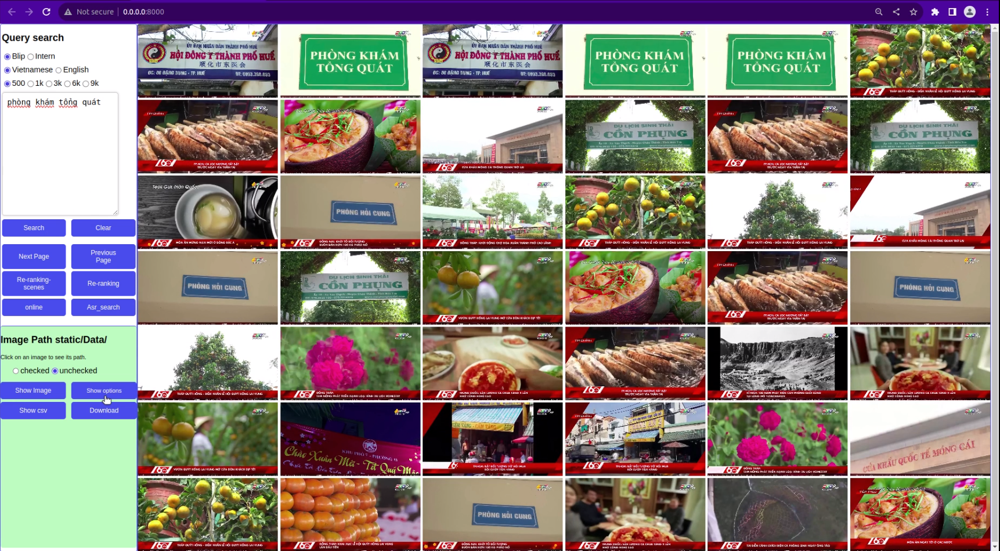

## THESIS UTE
---
## Setup
```
pip install -r requirements.txt (faiss gpu or faiss cpu depend your device)

```
- Folder tree
```

├── AIC_2023/ 
│   ├── static/
         └── team3
	      └── css/styles.css
	      └── js/script.js
	 └── Video
	      └── video_scenes_L01
	      └── video_scenes_L02
	      └── ...
         └── Data
              └── Keyframes_L01
                      └── 000000.jpg
                      └── 000001.jpg
              └── Keyframes_L02
                      └── 000000.jpg
                      └── 000001.jpg
     ├── blip_bin_json
	        └── file.bin
	        └── file.json
     ├── interb_bin_json
	        └── file.bin
	        └── file.json
     ├── video_summary
	        └── model
	              └── file.ckpt

```
## Data
#### File bin/json
- [blip_bin_json](https://drive.google.com/drive/folders/1WepsGul2H9KKWdyl9u4jMMrDoQs8WY2q?usp=sharing)
- [intern_bin_json](https://drive.google.com/drive/folders/1IHSGof7YPns13xbErPAkQ-fybJUPP4ZG?usp=sharing)
#### Keyframes
- [batch 1](https://www.kaggle.com/datasets/trnhuhiu/data-hcm-ai-challenge-2023-batch-1)
- [batch 2](https://www.kaggle.com/datasets/trnhuhiu/data-hcm-ai-challenge-2023-batch-2)
- [batch 3 part1](https://www.kaggle.com/datasets/tuannguyenhoanganh/keyframes-batc3-part1)
- [batch 3 part2]()
#### Video scenes
- [batch 1](https://www.kaggle.com/datasets/6b1c2c1245a3793ea7bcce0b37b8b6bebb41a3449a407c98df85028be9b672c9?fbclid=IwAR311UTuYq43KyJcAe4hTB9Swzgwff4lrnnENZ7pweaY_h1eqBW0EYr8o3o)
- [batch 2](https://www.kaggle.com/datasets/tuannguyenhoanganh/video-scenes-batch-2)
- [batch 3 part1](https://www.kaggle.com/datasets/tuannguyenhoanganh/video-scenes-batch3-part1)
- [batch 3 part2](https://www.kaggle.com/datasets/tuannguyenhoanganh/video-scenes-batch3-part2)
## Inference
```
python fastAPI_local.py

```
## Main Functions of the web
- Text search (Eng or Vietnamese)
- Image search 
- ASR search
- Re-ranking 
- Get video frame
- Show video frame
- Submit
## Demo
#### web
- 
